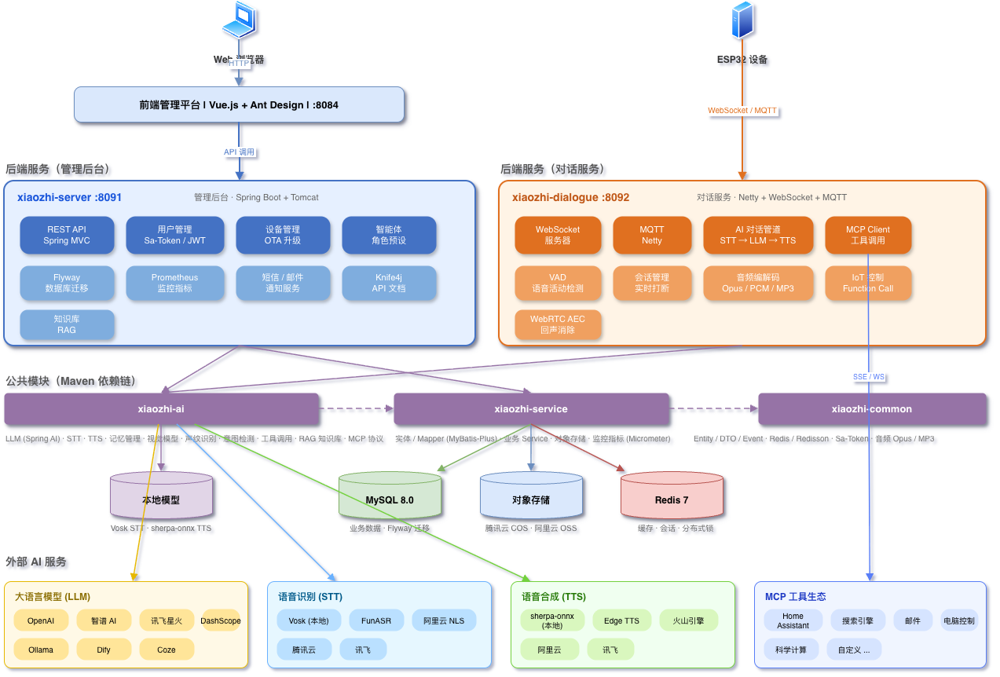
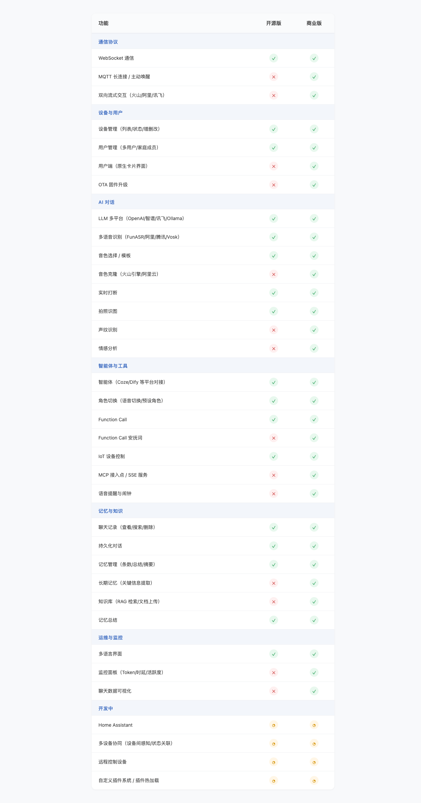
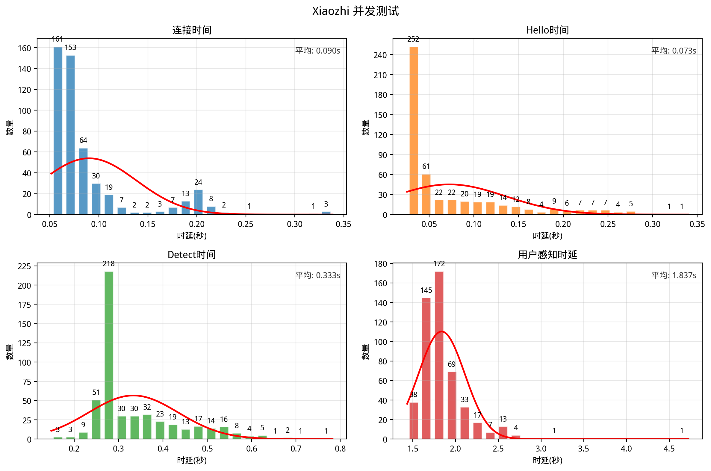
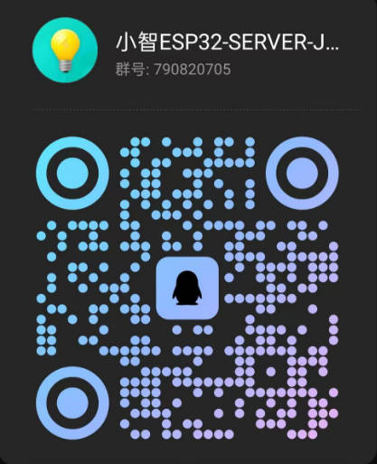

<h1 align="center">Xiaozhi ESP32 Server Java</h1>

<p align="center">
  基于 <a href="https://github.com/78/xiaozhi-esp32">Xiaozhi ESP32</a> 项目开发的 Java 版本服务端，包含完整前后端管理平台<br/>
  为智能硬件设备提供强大的后端支持和直观的管理界面
</p>

<p align="center">
  <a href="https://github.com/joey-zhou/xiaozhi-esp32-server-java/issues">反馈问题</a>
  · <a href="#deployment">部署文档</a>
  · <a href="https://github.com/joey-zhou/xiaozhi-esp32-server-java/blob/main/CHANGELOG.md">更新日志</a>
</p>

<p align="center">
  <a href="https://trendshift.io/repositories/13936" target="_blank"></a>
</p>

<p align="center">
  <a href="https://github.com/joey-zhou/xiaozhi-esp32-server-java/graphs/contributors">
    
  </a>
  <a href="https://github.com/joey-zhou/xiaozhi-esp32-server-java/issues">
    
  </a>
  <a href="https://github.com/joey-zhou/xiaozhi-esp32-server-java/pulls">
    
  </a>
  <a href="https://github.com/joey-zhou/xiaozhi-esp32-server-java/blob/main/LICENSE">
    
  </a>
  <a href="https://github.com/joey-zhou/xiaozhi-esp32-server-java">
    
  </a>
</p>

<p align="center">
  <b>如果这个项目对您有帮助，请考虑给它一个 ⭐ Star！</b><br/>
  您的支持是我们持续改进的动力！
</p>

---

## 项目简介

Xiaozhi ESP32 Server Java 是基于 [Xiaozhi ESP32](https://github.com/78/xiaozhi-esp32) 项目开发的 **Java 企业级服务端**，采用多模块 + 双进程架构设计，为 ESP32 智能硬件提供完整的后端支撑和可视化管理平台。

### 核心亮点

- **多模块 + 双进程架构** — 管理后台与对话服务独立运行，互不影响，支持分别扩容
- **多 AI 平台集成** — OpenAI / 智谱 / 讯飞 / Ollama / Dify / Coze，MCP 工具协议扩展
- **语音全链路** — 本地 & 云端 STT/TTS，音色克隆，实时打断，双向流式交互
- **WebSocket + MQTT** — 实时双向通信，服务端主动唤醒，OTA 远程升级
- **IoT 智能家居** — 语音指令控制设备，多设备协同，Function Call 智能决策
- **RAG 知识库** — 文档上传，智能检索增强生成，长期记忆管理
- **全链路监控** — Token / 时延 / 设备活跃度等多维度数据可视化
- **一键部署** — bin 脚本 / Docker Compose，Flyway 自动建表，模型自动下载

### 技术栈

| 类别 | 技术选型 |
|------|----------|
| **后端** | Spring Boot、Spring MVC、MyBatis-Plus、Flyway、WebSocket |
| **前端** | Vue.js、Ant Design、响应式布局 |
| **数据层** | MySQL 8.0、Redis 7 |
| **语音识别** | Vosk、FunASR、阿里云、腾讯云、讯飞 |
| **语音合成** | sherpa-onnx（本地）、火山引擎、阿里云、Edge TTS |
| **大语言模型** | OpenAI、智谱 AI、讯飞星火、Ollama、Dify、Coze |
| **扩展能力** | MCP 工具协议、Function Call、RAG 知识库、音色克隆 |

---

## 项目架构

<div align="center">
  
  <p><sub>📐 架构图源文件：<a href="docs/architecture.drawio">docs/architecture.drawio</a>（可用 <a href="https://app.diagrams.net">draw.io</a> 打开编辑）</sub></p>
</div>

> **双进程架构**：两个独立进程共享 MySQL 和 Redis，可分别部署与扩容。
> - `xiaozhi-server` :8091 — 管理后台，提供 REST API、用户/设备/角色管理、OTA 升级
> - `xiaozhi-dialogue` :8092 — 对话服务，处理 WebSocket/MQTT 实时音频流、AI 对话管道
>
> `dialogue` 支持横向扩展，新实例自动注册至 `server`，通过设备 OTA 实现负载均衡。

---

## 适用人群

- 已购买 ESP32 硬件，需要功能完善的管理平台
- 需要企业级稳定性和扩展性
- 个人开发者，希望快速搭建使用
- 需要支持大量设备并发连接的场景

---

## 功能对比

> 部分功能未开源，有需求请通过下方联系方式沟通

<div align="center">
  
</div>

---

<a id="deployment"></a>
## 部署文档

### 快速开始

```bash
git clone https://github.com/joey-zhou/xiaozhi-esp32-server-java
cd xiaozhi-esp32-server-java
./scripts/download_models.sh   # 下载模型和原生库（首次必须）
bin/all.sh start               # 一键编译并启动（server + dialogue）
bin/all.sh status              # 查看状态
```

> `models/` 和 `lib/` 不在 Git 仓库中，首次部署需通过脚本下载。使用第三方 STT/TTS 可只运行 `./scripts/download_base.sh`（仅下载 VAD 模型和原生库）。

### 部署方式

| 方式 | 文档 | 说明 |
|------|------|------|
| 源码部署（Linux） | [CentOS 部署文档](./docs/CENTOS_DEVELOPMENT.md) | 推荐生产环境 |
| 源码部署（Windows） | [Windows 部署文档](./docs/WINDOWS_DEVELOPMENT.md) | 开发和测试 |
| Docker | [Docker 部署文档](./docs/DOCKER.md) | 快速容器化部署 |
| 固件编译 | [固件编译文档](./docs/FIRMWARE-BUILD.md) | ESP32 固件编译和烧录 |

成功运行后，xiaozhi-server会输出 OTA 和 xiaozhi-dialogue会输出 WebSocket 连接地址，根据固件编译文档使设备接入服务使用。

---

## 性能测试

我们开发了专门的 WebSocket 并发测试工具 [Xiaozhi Concurrent](https://github.com/joey-zhou/xiaozhi-concurrent)，用于评估系统的性能和稳定性。测试工具支持模拟大量设备同时连接，测试完整的 WebSocket 通信流程，并生成详细的性能报告和可视化图表。

> 📖 测试工具的详细使用说明、安装步骤和参数配置请查看：[Xiaozhi Concurrent 仓库](https://github.com/joey-zhou/xiaozhi-concurrent)

### 基准测试结果

以下测试数据基于**腾讯云服务器（8核8G，100M按量付费带宽）** 环境，**100个设备、100并发连接、持续5轮** 对话测试：

#### 性能指标

| 测试项目 | 成功率 | 平均时延 | 最小值 | 最大值 | 备注 |
|---------|-------|---------|-------|-------|------|
| WebSocket连接 | 100% (500/500) | 0.090s | - | - | 建立连接耗时 |
| Hello握手 | 100% (500/500) | 0.073s | - | - | 握手响应时间 |
| 唤醒词响应 | 100% (500/500) | 0.333s | - | - | 唤醒词到音频回复 |
| 语音识别准确率 | 100% (500/500) | - | - | - | 真实音频识别 |
| 语音识别时延 | - | 0.988s | 0.949s | 1.255s | ASR识别耗时（包含800ms静音） |
| 服务器处理时延 | - | 0.849s | 0.454s | 3.759s | 服务端处理耗时（LLM+TTS） |
| 用户感知时延 | - | 1.837s | 1.433s | 4.723s | 说话结束到收到回复 |

#### 服务器资源占用

| 资源类型 | 空闲时 | 峰值 | 说明 |
|---------|-------|------|------|
| CPU使用率 | 0% | 80% | 8核CPU占用率 |
| 内存占用 | 1.8G | 1.96G | JVM堆内存稳定 |
| 网络带宽(上行) | 0 | 2200KB/s | 客户端音频上传 |
| 网络带宽(下行) | 0 | 3300KB/s | 服务端音频下发 |
| WebSocket连接数 | 0 | 100 | 并发活跃连接数 |

#### 音频传输质量

| 指标 | 数值 | 说明 |
|-----|------|------|
| 音频帧平均间隔 | 58.07ms | 音频帧发送间隔 |
| 帧延迟率 | 8.47% (4226/49918) | >65ms |

### 测试结果可视化

<div align="center">
    
    <p><strong>并发测试数据可视化</strong> - 时延分布与性能指标统计</p>
</div>

---

### 商业合作

我们接受各种项目开发，如果您有特定需求或对商业版本感兴趣，欢迎通过微信联系洽谈。


## 贡献指南

欢迎任何形式的贡献！如果您有好的想法或发现问题，请通过以下方式联系我们：

### 微信

微信群超200人无法扫码进群，可以加我微信备注 小智 我拉你进微信群


### QQ

欢迎加入我们的QQ群一起交流讨论，QQ群号：790820705



---

## 免责声明

本项目仅提供技术实现代码，不提供任何媒体内容。用户在使用相关功能时应确保拥有合法的使用权或版权许可，并遵守所在地区的版权法律法规。

项目中可能涉及的示例内容或资源均来自网络或由用户投稿提供，仅用于功能演示和技术测试。如有任何内容侵犯了您的权益，请立即联系我们，我们将在核实后立即采取删除等处理措施。

本项目开发者不对用户使用本项目代码获取或播放的任何内容承担法律责任。使用本项目即表示您同意自行承担使用过程中的全部法律风险和责任。

---

## Star History

<a href="https://www.star-history.com/#joey-zhou/xiaozhi-esp32-server-java&Date">
 <picture>
   <source media="(prefers-color-scheme: dark)" srcset="https://api.star-history.com/svg?repos=joey-zhou/xiaozhi-esp32-server-java&type=Date&theme=dark" />
   <source media="(prefers-color-scheme: light)" srcset="https://api.star-history.com/svg?repos=joey-zhou/xiaozhi-esp32-server-java&type=Date" />
   
 </picture>
</a>