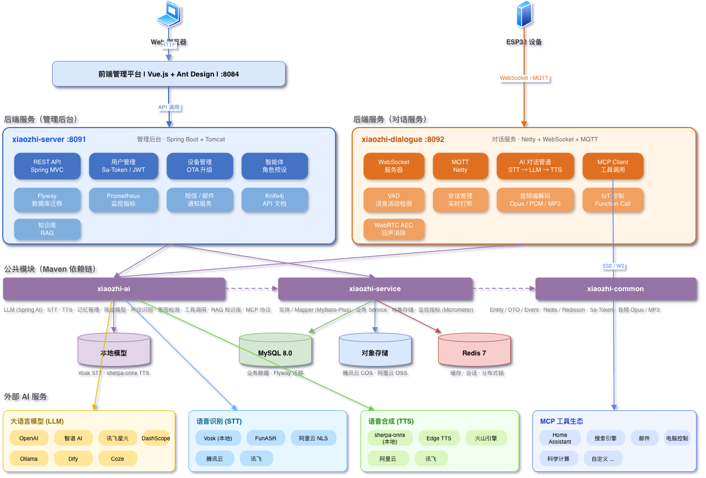
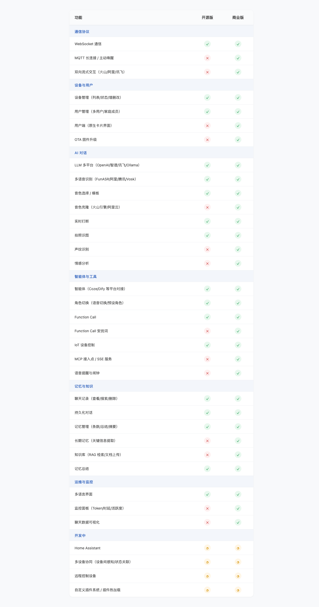
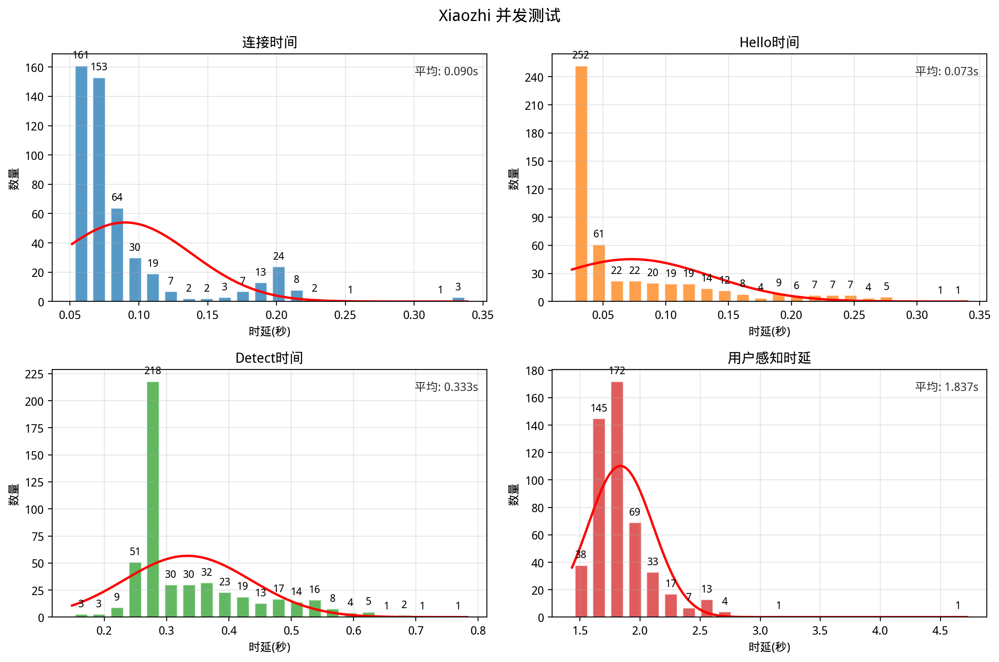

<h1 align="center">Xiaozhi ESP32 Server Java — Brasil</h1>

<p align="center">
  Servidor em Java para o projeto <a href="https://github.com/78/xiaozhi-esp32">Xiaozhi ESP32</a>, com plataforma completa de administração (front-end + back-end)<br/>
  Fork traduzido e adaptado para o público brasileiro, com backend robusto e interface de administração intuitiva para dispositivos de hardware inteligente
</p>

<p align="center">
  <a href="https://github.com/Acogero/xiaozhi-brasil-esp32-server-java/issues">Reportar problema</a>
  · <a href="#deployment">Documentação de implantação</a>
  · <a href="https://github.com/Acogero/xiaozhi-brasil-esp32-server-java/blob/main/CHANGELOG.md">Changelog</a>
</p>

<p align="center">
  <a href="https://trendshift.io/repositories/13936" target="_blank"></a>
</p>

<p align="center">
  <a href="https://github.com/Acogero/xiaozhi-brasil-esp32-server-java/graphs/contributors">
    
  </a>
  <a href="https://github.com/Acogero/xiaozhi-brasil-esp32-server-java/issues">
    
  </a>
  <a href="https://github.com/Acogero/xiaozhi-brasil-esp32-server-java/pulls">
    
  </a>
  <a href="https://github.com/Acogero/xiaozhi-brasil-esp32-server-java/blob/main/LICENSE">
    
  </a>
  <a href="https://github.com/Acogero/xiaozhi-brasil-esp32-server-java">
    
  </a>
</p>

<p align="center">
  <b>Se este projeto te ajudou, considere dar uma ⭐ Star!</b><br/>
  Seu apoio é o que nos motiva a continuar melhorando!
</p>

---

## Sobre o projeto

Este é um fork em português do **Xiaozhi ESP32 Server Java**, baseado no projeto original de [joey-zhou](https://github.com/joey-zhou/xiaozhi-esp32-server-java), que por sua vez foi desenvolvido a partir do [Xiaozhi ESP32](https://github.com/78/xiaozhi-esp32). É um **servidor Java de nível empresarial**, com arquitetura multi-módulo e de processo duplo, que oferece suporte completo de backend e uma plataforma visual de administração para hardware inteligente baseado em ESP32.

O objetivo deste fork é traduzir a documentação, adaptar o projeto ao contexto brasileiro (idioma, integrações e comunidade) e evoluir o código com melhorias pensadas para quem está começando a mexer com ESP32 e IA por aqui.

### Destaques principais

- **Arquitetura multi-módulo + processo duplo** — o painel de administração e o serviço de diálogo rodam de forma independente, sem impacto mútuo, e podem escalar separadamente
- **Integração com múltiplas plataformas de IA** — OpenAI / Zhipu / iFlytek / Ollama / Dify / Coze, com extensão via protocolo de ferramentas MCP
- **Pipeline completo de voz** — STT/TTS local e em nuvem, clonagem de voz, interrupção em tempo real, interação bidirecional em streaming
- **WebSocket + MQTT** — comunicação bidirecional em tempo real, ativação remota pelo servidor, atualização OTA
- **Casa inteligente (IoT)** — controle de dispositivos por comando de voz, coordenação entre múltiplos dispositivos, decisões inteligentes via Function Call
- **Base de conhecimento RAG** — upload de documentos, geração aumentada por recuperação, gerenciamento de memória de longo prazo
- **Monitoramento completo** — visualização de dados multidimensionais: tokens, latência, atividade de dispositivos, entre outros
- **Deploy em um comando** — scripts em `bin/` ou Docker Compose, criação automática de tabelas via Flyway, download automático de modelos

### Stack tecnológica

| Categoria | Tecnologias |
|------|----------|
| **Backend** | Spring Boot, Spring MVC, MyBatis-Plus, Flyway, WebSocket |
| **Frontend** | Vue.js, Ant Design, layout responsivo |
| **Camada de dados** | MySQL 8.0, Redis 7 |
| **Reconhecimento de voz** | Vosk, FunASR, Alibaba Cloud, Tencent Cloud, iFlytek |
| **Síntese de voz** | sherpa-onnx (local), Volcano Engine, Alibaba Cloud, Edge TTS |
| **Modelos de linguagem** | OpenAI, Zhipu AI, iFlytek Spark, Ollama, Dify, Coze |
| **Recursos avançados** | Protocolo de ferramentas MCP, Function Call, base de conhecimento RAG, clonagem de voz |

---

## Arquitetura do projeto

<div align="center">
  
  <p><sub>📐 Arquivo-fonte do diagrama: <a href="docs/architecture.drawio">docs/architecture.drawio</a> (pode ser aberto e editado no <a href="https://app.diagrams.net">draw.io</a>)</sub></p>
</div>

> **Arquitetura de processo duplo**: dois processos independentes compartilham MySQL e Redis, e podem ser implantados e escalados separadamente.
> - `xiaozhi-server` :8091 — painel de administração, expõe a API REST e gerencia usuários/dispositivos/perfis, além da atualização OTA
> - `xiaozhi-dialogue` :8092 — serviço de diálogo, processa o fluxo de áudio em tempo real via WebSocket/MQTT e o pipeline de conversação com IA
>
> O `dialogue` suporta escalonamento horizontal: novas instâncias se registram automaticamente no `server`, e o balanceamento de carga é feito através da OTA dos dispositivos.

---

## Para quem é este projeto

- Quem já tem hardware ESP32 e precisa de uma plataforma de administração completa
- Quem precisa de estabilidade e escalabilidade de nível empresarial
- Desenvolvedores individuais que querem montar uma solução rapidamente
- Cenários que exigem suporte a um grande volume de dispositivos conectados simultaneamente

---

## Comparação de funcionalidades

> Algumas funcionalidades não são open source. Se precisar delas, entre em contato pelos canais abaixo.

<div align="center">
  
</div>

---

<a id="deployment"></a>
## Documentação de implantação

### Início rápido

```bash
git clone https://github.com/Acogero/xiaozhi-brasil-esp32-server-java
cd xiaozhi-brasil-esp32-server-java
./scripts/download_models.sh   # Baixa os modelos e bibliotecas nativas (obrigatório na primeira execução)
bin/all.sh start               # Compila e inicia tudo em um comando (server + dialogue)
bin/all.sh status               # Verifica o status
```

> As pastas `models/` e `lib/` não ficam no repositório Git — é preciso baixá-las via script na primeira implantação. Se for usar STT/TTS de terceiros, basta rodar `./scripts/download_base.sh` (baixa apenas o modelo VAD e as bibliotecas nativas).

### Formas de implantação

| Método | Documentação | Observação |
|------|------|------|
| Deploy via código-fonte (Linux) | [Documentação de deploy no CentOS](./docs/CENTOS_DEVELOPMENT.md) | Recomendado para produção |
| Deploy via código-fonte (Windows) | [Documentação de deploy no Windows](./docs/WINDOWS_DEVELOPMENT.md) | Para desenvolvimento e testes |
| Docker | [Documentação de deploy com Docker](./docs/DOCKER.md) | Deploy rápido em container |
| Compilação de firmware | [Documentação de compilação do firmware](./docs/FIRMWARE-BUILD.md) | Compilação e gravação do firmware do ESP32 |

Após rodar com sucesso, o `xiaozhi-server` exibirá o endereço de OTA e o `xiaozhi-dialogue` exibirá o endereço de conexão WebSocket; use-os no dispositivo conforme a documentação de compilação do firmware.

---

## Testes de performance

> ℹ️ **Nota sobre a origem dos dados**: os números abaixo vêm dos testes realizados pelo projeto original em chinês, em servidores na China. Ainda não rodamos um benchmark próprio para o fork brasileiro (com infraestrutura e condições de rede locais), então trate estes valores como referência do projeto upstream, não como garantia de desempenho por aqui. Pretendemos publicar números atualizados assim que tivermos um ambiente de teste no Brasil.

Foi desenvolvida uma ferramenta dedicada de teste de concorrência via WebSocket, o [Xiaozhi Concurrent](https://github.com/joey-zhou/xiaozhi-concurrent), para avaliar a performance e a estabilidade do sistema. A ferramenta simula um grande número de dispositivos conectados simultaneamente, testa o fluxo completo de comunicação via WebSocket e gera relatórios de performance detalhados, com gráficos.

> 📖 Instruções detalhadas de uso, instalação e configuração de parâmetros da ferramenta: [repositório Xiaozhi Concurrent](https://github.com/joey-zhou/xiaozhi-concurrent)

### Resultado do benchmark (dados do projeto original)

Os dados abaixo foram obtidos em um **servidor Tencent Cloud (8 vCPUs, 8 GB RAM, banda de 100 Mbps sob demanda)**, em um teste de conversação com **100 dispositivos, 100 conexões simultâneas, 5 rodadas seguidas**.

#### Indicadores de performance

| Item testado | Taxa de sucesso | Latência média | Mínimo | Máximo | Observação |
|---------|-------|---------|-------|-------|------|
| Conexão WebSocket | 100% (500/500) | 0,090s | - | - | Tempo para estabelecer a conexão |
| Handshake Hello | 100% (500/500) | 0,073s | - | - | Tempo de resposta do handshake |
| Resposta à palavra de ativação | 100% (500/500) | 0,333s | - | - | Da palavra de ativação até a resposta em áudio |
| Precisão do reconhecimento de voz | 100% (500/500) | - | - | - | Reconhecimento com áudio real |
| Latência do reconhecimento de voz | - | 0,988s | 0,949s | 1,255s | Tempo de ASR (inclui 800ms de silêncio) |
| Latência de processamento no servidor | - | 0,849s | 0,454s | 3,759s | Tempo de processamento no servidor (LLM+TTS) |
| Latência percebida pelo usuário | - | 1,837s | 1,433s | 4,723s | Do fim da fala até o recebimento da resposta |

#### Uso de recursos do servidor

| Tipo de recurso | Ocioso | Pico | Observação |
|---------|-------|------|------|
| Uso de CPU | 0% | 80% | Uso em 8 vCPUs |
| Uso de memória | 1,8G | 1,96G | Heap da JVM estável |
| Banda de rede (upload) | 0 | 2200KB/s | Upload de áudio do cliente |
| Banda de rede (download) | 0 | 3300KB/s | Envio de áudio pelo servidor |
| Conexões WebSocket | 0 | 100 | Conexões simultâneas ativas |

#### Qualidade da transmissão de áudio

| Indicador | Valor | Observação |
|-----|------|------|
| Intervalo médio entre frames de áudio | 58,07ms | Intervalo de envio dos frames de áudio |
| Taxa de atraso de frames | 8,47% (4226/49918) | > 65ms |

### Visualização dos resultados

<div align="center">
    
    <p><strong>Visualização dos dados de teste de concorrência</strong> - distribuição de latência e estatísticas de performance</p>
</div>

---

## Comunidade e contribuição

Contribuições de qualquer forma são bem-vindas! Se você tem uma boa ideia ou encontrou um problema, participe pelos canais abaixo:

- **GitHub Issues**: [abra uma issue](https://github.com/Acogero/xiaozhi-brasil-esp32-server-java/issues) para reportar bugs ou sugerir melhorias
- **GitHub Discussions**: _(em breve — link do fórum de discussões do fork)_
- **Discord / Telegram**: _(em breve — canal da comunidade brasileira, adicione o link aqui quando estiver criado)_

> Os grupos de WeChat e QQ do projeto original continuam ativos para a comunidade chinesa; consulte o [repositório original](https://github.com/joey-zhou/xiaozhi-esp32-server-java) caso queira participar deles.

---

## Aviso legal

Este projeto fornece apenas a implementação técnica em código, sem disponibilizar qualquer conteúdo de mídia. Ao usar as funcionalidades relacionadas, o usuário deve garantir que possui os direitos de uso ou licenças de direitos autorais aplicáveis, e deve cumprir a legislação de direitos autorais vigente em sua região.

Eventuais conteúdos ou recursos de exemplo presentes no projeto vêm da internet ou foram enviados por usuários, e servem apenas para demonstração de funcionalidades e testes técnicos. Se algum conteúdo violar seus direitos, entre em contato imediatamente — o material será removido após a devida verificação.

Os desenvolvedores deste projeto não se responsabilizam legalmente por qualquer conteúdo obtido ou reproduzido pelos usuários através do código deste projeto. Ao utilizar este projeto, você concorda em assumir integralmente os riscos e responsabilidades legais decorrentes do seu uso.

---
